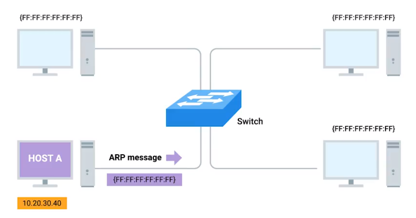

Hardware in each layer
|Hardware|Layer|Protocol|Protocol Data Unit|Addressing
|--|--| --|--|--|
|Hub|Physical|10 Base T protocol||
|Switch|Data Link|Ethernet|IP address
|Router|Network|

## Network Layer
#### 1.1
MAC address is so unique that there is no way of knowing where can find the location of the MAC address in time
**ARP** Address Resolution Protocol
Solution: Network Layer - IP

#### 1.2 IP Addresses
**32 bit (4 octets) address, ofter decribed in decimal numbers
Dotted Decimal Notation 点分十进制**
*1 octet can represent 2^8 (0-255) decimal number*
> decimal sample: 202.123.45.1
> same as: 10101100.11000011.01010011.10100001

IP address are distributed in large sections like company and organisations and belong to network (not like MAC belong to different devices)

Dynamic Host Configuration Protocol
- Static IP addresses for server and devices
- Dynamtic IP addresses for clients

#### 1.3 IP Datagrams

**IP Datagrams are the payload after encapsulation from Ethernet headers.** 
IP datagram also has a payload for upper layer.

IP datagram:
Version, Header Length, Service Type(QoP), Total Length,
Identification, Flag, Fragment Offset,
TTL, Protocol, Header Checksum,
Source IP Address,
Destination IP Address,
Options, Padding

#### IP Address Classes
IP Address => Network  + Host Addresses

|Class|Range(DEC.)(BIN.)|Max Hosts|Rules|
|----|----|----|----|
|Class A|0-127 (0)|16 Million (2^24-n)|1st octet is used as Network ID|
|Class B|128-191(10)|64000(2^16-n)|1st and 2nd octets NetworkID|
|Class C|192-223(110)|254(2^8-2)|1st to 3rd octets NetworkID|
|*Class E*|224-239(1110)|N/A|For broadcasting|
|*Class F*|240-255(11110)|N/A|For testing|

In practical, the class system has been replace by CIDR (无类别域间路由) , but still very important.

#### 1.4 ARP
*Address Resolution Protocol*
**ARP table:** records MAC addresses and IP addresses associated
*ARP Process*

