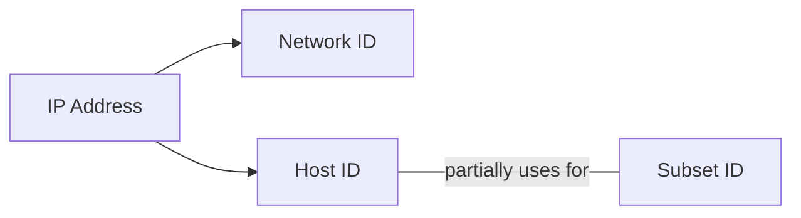
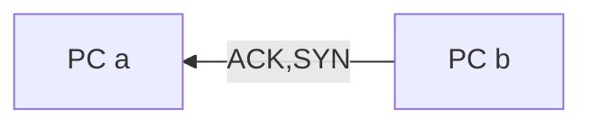
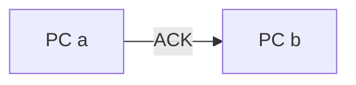
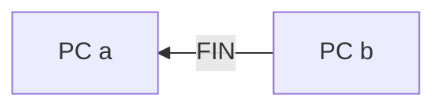
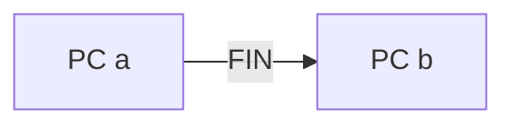
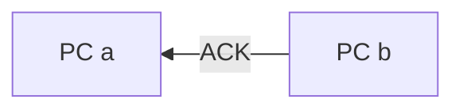
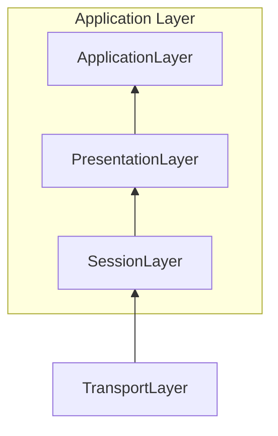
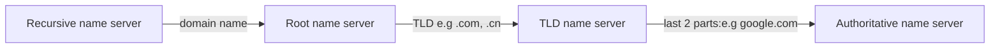

OSI 5 Layers Model


Hardware in each layer

|Hardware|Layer|Protocol|Protocol Data Unit|Addressing
|--|--| --|--|--|
|Hub|Physical|10 Base T protocol||
|Switch|Data Link|Ethernet|IP address
|Router|Network|


## Network Layer
#### 1.1
MAC address is so unique that there is no way of knowing where can find the location of the MAC address in time
**ARP** Address Resolution Protocol
Solution: Network Layer - IP

#### 1.2 IP Addresses
**32 bit (4 octets) address, ofter decribed in decimal numbers
Dotted Decimal Notation 点分十进制**
*1 octet can represent 2^8 (0-255) decimal number*
> decimal sample: 202.123.45.1
> same as: 10101100.11000011.01010011.10100001

IP address are distributed in large sections like company and organisations and belong to network (not like MAC belong to different devices)

Dynamic Host Configuration Protocol
- Static IP addresses for server and devices
- Dynamtic IP addresses for clients

#### 1.3 IP Datagrams

**IP Datagrams are the payload after encapsulation from Ethernet headers.** 
IP datagram also has a payload for upper layer.

IP datagram:  

|0|4|8|16|19|31|
|-|-|-|-|-|-|
|version|header length|service type(QoS)|total length|
|identification|||flag|fragment offset||
|TTL||Protocol|Header Checksum|
|source IP addr|
|dest IP addr|
|options||||padding


Version, Header Length, Service Type(QoS), Total Length,  
Identification, Flag, Fragment Offset,  
TTL, Protocol, Header Checksum,  
Source IP Address,  
Destination IP Address,  
Options, Padding

#### IP Address Classes
IP Address => Network  + Host Addresses

|Class|Range(DEC.)(BIN.)|Max Hosts|Rules|
|----|----|----|----|
|Class A|0-127 (0)|16 Million (2^24-n)|1st octet is used as Network ID|
|Class B|128-191(10)|64000(2^16-n)|1st and 2nd octets NetworkID|
|Class C|192-223(110)|254(2^8-2)|1st to 3rd octets NetworkID|
|*Class E*|224-239(1110)|N/A|For broadcasting|
|*Class F*|240-255(11110)|N/A|For testing|

In practical, the class system has been replace by CIDR (无类别域间路由) , but still very important.

#### 1.4 ARP
*Address Resolution Protocol*
**ARP table:** records MAC addresses and IP addresses associated
*ARP Process*


### 2. Subnetting
#### 2.1 subnetting
Split a large network into a few individual subnetworks
 ``` mermaid
 graph LR
	A[Core router]--route-->B(Gateway router)
	A---C(Core routers)
	B---D(Gateway routers)
 ```

#### 2.2 Subnet Mask

**Subnet Masks**    

32 bits

|IP |9.|100.|100.|100|
|:--|--|--|--|--|
|IP(bin)|00001001|01100100|01100100|01100100|
|Subnet Mask(bin)|11111111|1111111|11111111|00000000|
|Subnet (dec)|255.|255.|255.|0|
|Part Explanation|Network ID|with 1: Subnet ID||with 0: Host ID|

*Note: This sample has 254 host ID available because 0 is generally not used and 255 reserves a broadcast address*    
Another example:    

|IP |9.|100.|100.|100|
|:-|-|-|-|
|Subnet|255.|255.|255.|224|
|dec|11111111|11111111|11111111|11100000|
Means only last 5 bits is host ID
The IP address can be represented as 9.100.100.100/27 (because of 27 0s)


#### 2.3 Subnet mask in binary math
Subnet mask calculation is using **AND** calculation to determine if the IP address is on the same network.    

|IP Address|9|100|100|100|
|:-|-|-|-|-|
|AND|AND|AND|AND|AND|
|Subnet Mask|11111111|11111111|11111111|00000000|
|Subnet ID|9|100|100||

The subnet ID is 9.100.100, will use it to determine to check.

#### CIDR
Classless inter-domain Routing
9.100.100.100 **/27** : this slash content is CIDR notation
***No need to consider classes anymore in this  case.***
Speciality of CIDR:
**CIDR**: **combine the address spaces into one continguous trunk** 
Like one with class C:  *(1)* 255.255.255.0/24 class C not enough, then
Can use *(2)* 255.255.254.0/23
(1) got 2^8 = 256 host bits,  *(256-2) = 254, 254x2 = 508* 
(2) got 2^9 = 512 host bits, *(512 - 2) = 510* 

CIDR is using some the network bits as host bits.
[Very good description of CIDR and VLSM](http://blog.51cto.com/liufei888/1250259)

### 3. Routing
#### 3.1 Concepts
|Network A|router 1|Network B|router 2|Network C|
|-|-|-|-|-|
|PC: IP addr 1--Ethernet Frame-->router1 addr1|router1 received -- **encapsulate into IP datagram** -- Checked the router table, find the **fastest** way to Network C -- **Duplicate the IP datagram, TTL -1, calculate new checksum** -- encapsulate into new Ethernet Frame -- send|router 1 set its MAC addr in Network B as source addr and send to router 2|same as router1's step  -- encapsulate into new Ethernet Frame|router 2 IP addr -- receive|

#### 3.2 Routing table
|Destination network|next hub|Total hub|interface|
|-|-|-|-|
|IP addr, subnet mask(CIDR)|

Relationship between IP, subnet mask, CIDR:    

IP|192.168.1.1
|:-|-
Subnet mask|255.255.255.0
CIDR|192.168.1.1/24
IP and Subnet mask can use one CIDR to represent.


#### 3.3 Interior gateway protocols
Distance vector protocol
```mermaid
graph LR
A-->B
F.->A
F-->E
B-->C
C-->D
C-->E
style A fill: #ffff00
```
React slow to non-directly linked nodes.

#### Link state protocol


Every router knows about every others' details:
So need more **memory** and more **processing power**


#### 3.4 Exterior Gateway Protocols
**IANA**: Internet Assigned Number Authority
**ASN**: Autonomous System Number is *32 bits* in decimal form, used and updated by Internet core routing tables.

#### 3.5 Routing protocols
RIP
EIGRP
OSPF
BGP

#### 3.6 Non routable address

10.0.0.0/8
172.16.0.0/12
192.168.0.0/16
Could be used in internal networks, will never be routed by co-routers.

RFC

### 4. Transport and application layers

#### 4.1.1 Concept

Transport layer: direct the traffic to specific network applications
Application layer: make the application communicate in the way they all understand 

Ports: 0-65535

Port0: Communication between different programs on the same computer.

Ports1-1023: System ports.

Ports1024-49151: Registered ports.

Ports49152-65535: Private or ephemeral ports, for establishing outbount connections. (Client connect with a server.)

#### 4.1.2 TCP Header


|Source port|||destination port|
|-|-|-|-|
|Sequence number|
|Acknowledge number|
|Header length|empty|control flags|Window|
|Checksum|||Urgent
|Option|||Padding
|Data Payload(varies)|

#### 4.1.3 Six TCP Control flags

ACK, SYN, FIN, URG(not in use), RST, PSH
    
        
**Establish TCP connection**
*The 3 way handshake*




**Ready to  close the connection**
*The 4 way handshake*






#### 4.1.4 TCP Socket States

A socket is a instantiation of a potiential endpoint in TCP connection.    
TCP sockets need actual programs to instantiate them.    
Compared with ports: A port is more virtual descriptive thing, means your can send traffic to any ports you want, but you will only get responsed if a programs has opened a socket on that port.

|Server|Client|
|-|-|
|Listen||
||SYN_SENT|
|SYN-RECEIVED||
|ESTABLISHED|ESTABLISHED
|FIN_WAIT|FIN_WAIT
|CLOSE_WAIT|CLOSE_WAIT
|CLOSED|CLOSED

#### 4.1.5 Connection-oriented and Connectionless Protocols

Connection-oriented: **TCP**
Connectionless Protocols (without acknowledge): **UDP**

TCP will take more bandwidth since need to check all the acknowledge or what. With the sequence number you can resend the data segment which you lost in a certain part.

#### 4.1.6 Firewall

Activate in **transport layer** and block certain ports from connecting.

Like website server will block port other than 80 (for user viewing the webpage) 


#### 4.2 Application Layer


Server need to share the same protocol to speak to different web browsers.

Web server: Microsoft IIS, Apache, nginx

#### 4.2.2 Application Layer and 7 level OSI Model
In OSI Model



**Session Layer**: Unencapsulate the data and pass it to Presentation Layer
**Presentation Layer**: Make sure Application Layer can understand the unencapsulated data.

#### 4.2.3 All the layers working in Unison

**Very Important!!!**

Revise the course for the whole process of transporting data:


Standard TTL number: 64

### 5. Network Services

#### 5.1 Name Resolution
DNS: domain name system 
Domain name: 
 1. can be resolved by DNS
 2. can keep the website availabe even if the IP(data center) is changed    

To increase the speed for people visiting faster, the website company may have different data centre in different places. Then by entering the domain name can choose the closest one to visit.

#### 5.2 Steps of name resolution
4 Things need to be configured for network:
- IP address,
- Subnet mask,
- Gateway for a host, 
- DNS.

5 primary types of DNS servers:

1. Caching name servers,
2. Recursive name servers,
3. Root name servers,
4. TLD name servers,
5. Authoritative name servers.

All domain names in caching name server have a TTL(time to live).


Authoritative name server is owned by organisation


*Technique: **Anycast*** 
A technique to route traffic to different destinations depending on factors: location, congestion or link health.

#### DNS and UDP    
