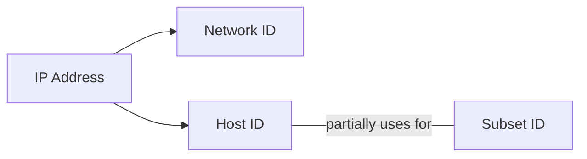
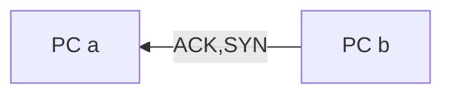
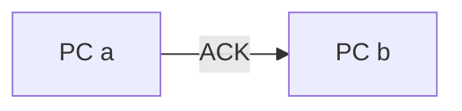
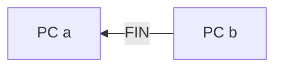
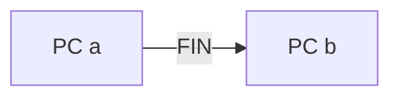
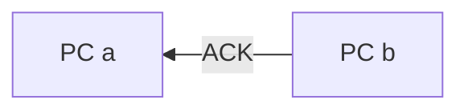
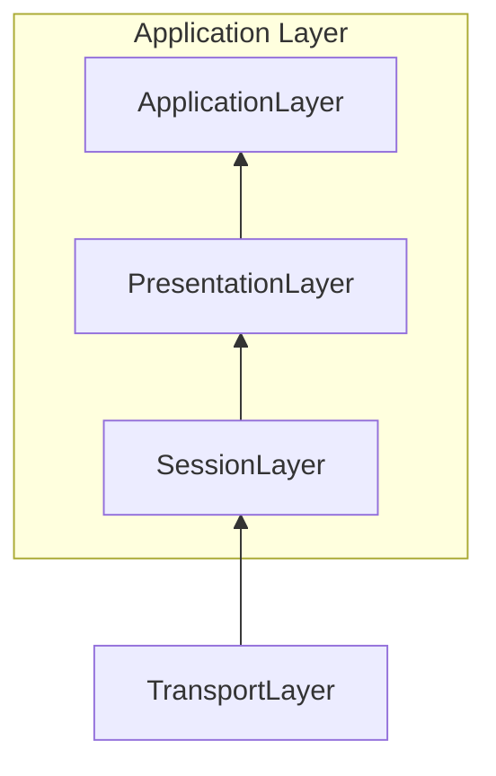
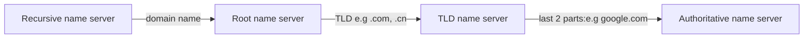

OSI 5 Layers Model


Hardware in each layer

|Hardware|Layer|Protocol|Protocol Data Unit|Addressing
|--|--| --|--|--|
|Hub|Physical|10 Base T protocol||
|Switch|Data Link|Ethernet|IP address
|Router|Network|


## Network Layer
#### 1.1
MAC address is so unique that there is no way of knowing where can find the location of the MAC address in time
**ARP** Address Resolution Protocol
Solution: Network Layer - IP

#### 1.2 IP Addresses
**32 bit (4 octets) address, ofter decribed in decimal numbers
Dotted Decimal Notation 点分十进制**
*1 octet can represent 2^8 (0-255) decimal number*
> decimal sample: 202.123.45.1
> same as: 10101100.11000011.01010011.10100001

IP address are distributed in large sections like company and organisations and belong to network (not like MAC belong to different devices)

Dynamic Host Configuration Protocol
- Static IP addresses for server and devices
- Dynamtic IP addresses for clients

#### 1.3 IP Datagrams

**IP Datagrams are the payload after encapsulation from Ethernet headers.** 
IP datagram also has a payload for upper layer.

IP datagram:  

|0|4|8|16|19|31|
|-|-|-|-|-|-|
|version|header length|service type(QoS)|total length|
|identification|||flag|fragment offset||
|TTL||Protocol|Header Checksum|
|source IP addr|
|dest IP addr|
|options||||padding


Version, Header Length, Service Type(QoS), Total Length,  
Identification, Flag, Fragment Offset,  
TTL, Protocol, Header Checksum,  
Source IP Address,  
Destination IP Address,  
Options, Padding

#### IP Address Classes
IP Address => Network  + Host Addresses

|Class|Range(DEC.)(BIN.)|Max Hosts|Rules|
|----|----|----|----|
|Class A|0-127 (0)|16 Million (2^24-n)|1st octet is used as Network ID|
|Class B|128-191(10)|64000(2^16-n)|1st and 2nd octets NetworkID|
|Class C|192-223(110)|254(2^8-2)|1st to 3rd octets NetworkID|
|*Class E*|224-239(1110)|N/A|For broadcasting|
|*Class F*|240-255(11110)|N/A|For testing|

In practical, the class system has been replace by CIDR (无类别域间路由) , but still very important.

#### 1.4 ARP
*Address Resolution Protocol*
**ARP table:** records MAC addresses and IP addresses associated
*ARP Process*


### 2. Subnetting
#### 2.1 subnetting
Split a large network into a few individual subnetworks
 ``` mermaid
 graph LR
	A[Core router]--route-->B(Gateway router)
	A---C(Core routers)
	B---D(Gateway routers)
 ```

#### 2.2 Subnet Mask

**Subnet Masks**    

32 bits

|IP |9.|100.|100.|100|
|:--|--|--|--|--|
|IP(bin)|00001001|01100100|01100100|01100100|
|Subnet Mask(bin)|11111111|1111111|11111111|00000000|
|Subnet (dec)|255.|255.|255.|0|
|Part Explanation|Network ID|with 1: Subnet ID||with 0: Host ID|

*Note: This sample has 254 host ID available because 0 is generally not used and 255 reserves a broadcast address*    
Another example:    

|IP |9.|100.|100.|100|
|:-|-|-|-|
|Subnet|255.|255.|255.|224|
|dec|11111111|11111111|11111111|11100000|
Means only last 5 bits is host ID
The IP address can be represented as 9.100.100.100/27 (because of 27 0s)


#### 2.3 Subnet mask in binary math
Subnet mask calculation is using **AND** calculation to determine if the IP address is on the same network.    

|IP Address|9|100|100|100|
|:-|-|-|-|-|
|AND|AND|AND|AND|AND|
|Subnet Mask|11111111|11111111|11111111|00000000|
|Subnet ID|9|100|100||

The subnet ID is 9.100.100, will use it to determine to check.

#### CIDR
Classless inter-domain Routing
9.100.100.100 **/27** : this slash content is CIDR notation
***No need to consider classes anymore in this  case.***
Speciality of CIDR:
**CIDR**: **combine the address spaces into one continguous trunk** 
Like one with class C:  *(1)* 255.255.255.0/24 class C not enough, then
Can use *(2)* 255.255.254.0/23
(1) got 2^8 = 256 host bits,  *(256-2) = 254, 254x2 = 508* 
(2) got 2^9 = 512 host bits, *(512 - 2) = 510* 

CIDR is using some the network bits as host bits.
[Very good description of CIDR and VLSM](http://blog.51cto.com/liufei888/1250259)

### 3. Routing
#### 3.1 Concepts
|Network A|router 1|Network B|router 2|Network C|
|-|-|-|-|-|
|PC: IP addr 1--Ethernet Frame-->router1 addr1|router1 received -- **encapsulate into IP datagram** -- Checked the router table, find the **fastest** way to Network C -- **Duplicate the IP datagram, TTL -1, calculate new checksum** -- encapsulate into new Ethernet Frame -- send|router 1 set its MAC addr in Network B as source addr and send to router 2|same as router1's step  -- encapsulate into new Ethernet Frame|router 2 IP addr -- receive|

#### 3.2 Routing table
|Destination network|next hub|Total hub|interface|
|-|-|-|-|
|IP addr, subnet mask(CIDR)|

Relationship between IP, subnet mask, CIDR:    

IP|192.168.1.1
|:-|-
Subnet mask|255.255.255.0
CIDR|192.168.1.1/24
IP and Subnet mask can use one CIDR to represent.


#### 3.3 Interior gateway protocols
Distance vector protocol
```mermaid
graph LR
A-->B
F.->A
F-->E
B-->C
C-->D
C-->E
style A fill: #ffff00
```
React slow to non-directly linked nodes.

#### Link state protocol


Every router knows about every others' details:
So need more **memory** and more **processing power**


#### 3.4 Exterior Gateway Protocols
**IANA**: Internet Assigned Number Authority
**ASN**: Autonomous System Number is *32 bits* in decimal form, used and updated by Internet core routing tables.

#### 3.5 Routing protocols
RIP
EIGRP
OSPF
BGP

#### 3.6 Non routable address

10.0.0.0/8
172.16.0.0/12
192.168.0.0/16
Could be used in internal networks, will never be routed by co-routers.

RFC

### 4. Transport and application layers

#### 4.1.1 Concept

Transport layer: direct the traffic to specific network applications
Application layer: make the application communicate in the way they all understand 

Ports: 0-65535

Port0: Communication between different programs on the same computer.

Ports1-1023: System ports.

Ports1024-49151: Registered ports.

Ports49152-65535: Private or ephemeral ports, for establishing outbount connections. (Client connect with a server.)

#### 4.1.2 TCP Header


|Source port|||destination port|
|-|-|-|-|
|Sequence number|
|Acknowledge number|
|Header length|empty|control flags|Window|
|Checksum|||Urgent
|Option|||Padding
|Data Payload(varies)|

#### 4.1.3 Six TCP Control flags

ACK, SYN, FIN, URG(not in use), RST, PSH
    
        
**Establish TCP connection**
*The 3 way handshake*




**Ready to  close the connection**
*The 4 way handshake*






#### 4.1.4 TCP Socket States

A socket is a instantiation of a potiential endpoint in TCP connection.    
TCP sockets need actual programs to instantiate them.    
Compared with ports: A port is more virtual descriptive thing, means your can send traffic to any ports you want, but you will only get responsed if a programs has opened a socket on that port.

|Server|Client|
|-|-|
|Listen||
||SYN_SENT|
|SYN-RECEIVED||
|ESTABLISHED|ESTABLISHED
|FIN_WAIT|FIN_WAIT
|CLOSE_WAIT|CLOSE_WAIT
|CLOSED|CLOSED

#### 4.1.5 Connection-oriented and Connectionless Protocols

Connection-oriented: **TCP**
Connectionless Protocols (without acknowledge): **UDP**

TCP will take more bandwidth since need to check all the acknowledge or what. With the sequence number you can resend the data segment which you lost in a certain part.

#### 4.1.6 Firewall

Activate in **transport layer** and block certain ports from connecting.

Like website server will block port other than 80 (for user viewing the webpage) 


#### 4.2 Application Layer


Server need to share the same protocol to speak to different web browsers.

Web server: Microsoft IIS, Apache, nginx

#### 4.2.2 Application Layer and 7 level OSI Model
In OSI Model



**Session Layer**: Unencapsulate the data and pass it to Presentation Layer
**Presentation Layer**: Make sure Application Layer can understand the unencapsulated data.

#### 4.2.3 All the layers working in Unison

**Very Important!!!**

Revise the course for the whole process of transporting data:


Standard TTL number: 64

### 5. Network Services

#### 5.1 Name Resolution
DNS: domain name system 
Domain name: 
 1. can be resolved by DNS
 2. can keep the website availabe even if the IP(data center) is changed    

To increase the speed for people visiting faster, the website company may have different data centre in different places. Then by entering the domain name can choose the closest one to visit.

#### 5.2 Steps of name resolution
4 Things need to be configured for network:
- IP address,
- Subnet mask,
- Gateway for a host, 
- DNS.

5 primary types of DNS servers:

1. Caching name servers,
2. Recursive name servers,
3. Root name servers,
4. TLD name servers,
5. Authoritative name servers.

All domain names in caching name server have a TTL(time to live).


Authoritative name server is owned by organisation


there are 13 total root name servers

*Technique: **Anycast*** 
A technique to route traffic to different destinations depending on factors: location, congestion or link health.

#### DNS and UDP    
Using TCP protocal to handle DNS request will cause **44** packets while using UDP will only use **8** packets.


But TCP is still in use while the packet is too large to be sent in UDP.

#### Resource Record Types

**A records**: multi A records then use **Round Robin**, for **IPv4**

Example: microsoft.com got 4 records of 10.1.1.1, 10.1.1.2, 10.1.1.3, 10.1.1.4 
When DNS receives 'microsoft.com', the 4 IPs will be returned in the sequence: 1,2,3,4 then for next visit, will be 2,3,4,1

**Quad A records(AAAA)**: same as A records, just for **IPv6**

CNAME records: redirect different names to the destination site

MX records: for emails

SRV records: for other services

TXT records: for txt records, mostly for configurations

More introduction for resource records: [域名服务器记录类型列表](More%20introduction%20for%20resource%20records:%20https://zh.wikipedia.org/wiki/%E5%9F%9F%E5%90%8D%E4%BC%BA%E6%9C%8D%E5%99%A8%E8%A8%98%E9%8C%84%E9%A1%9E%E5%9E%8B%E5%88%97%E8%A1%A8)

#### Anatomy of a Domain Name

www(1).google(2).com(3)

(1). **com**: TLD -- controlled by ICANN
(2) **google**: domain  use to demarcate where control moves from TLD server to authoritative server 
(3) **www**: subdomain -- sell by registrar

**FQDN**: Fully Qualified Domain Name

DNS can support **127** levels,
domain name each section can support **63** characters and an FQDN is limited to **255** characters

#### DNS Zones

for easier control over multiple level of a domain

zone file: SOA(start of authority), NS(name server) records

### Dynamic Host Configuration protocol    
#### Overview of DHCP    
**DHCP:** 
Can automatically set the configuration in one network
 1. IP address (mostly different)
 2.  Subnet mask (mostly the same)
 3.  Gateway (mostly the same)
 4. Name server (mostly the same)

**Ways:**
Dynamic allocation: IP could be different
Automatic allocation: a bit different: the DHCP server is asked to record which IP the certain device used in the past, and will assign the same IP to the same device each time if possible    
Fixed allocation: require MAC address and IPs

Whats more: DHCP can help set NTP servers (Network time protocol)


#### DHCP in Action    
DHCPDISCOVER -> DHCPOFFER -> DHCP REQUEST -> DHCPACK    

DHCPDISCOVER: attempt to get network configuration
0.0.0.0:68 -> 255.255.255.255:67    
DHCPOFFER: offer one IP
255.255.255.255:68 <- 192.168.1.1:67 (tell by MAC field)    
DHCP REQUEST: confirm to like to have the IP server offered    
0.0.0.0:68 -> 255.255.255.255:67    
PHCPACK(acknowledge): acknowledge message    
255.255.255.255:68 <- 192.168.1.1:67    

Now the client can use the configuration

### Network address translation
#### Basics of NAT

**NAT**: Allow a gateway(firewall or router often) to rewrite the source IP of an outgoing IP datagram while keep its original IP to rewrite it back when response.
**IP masquerading**


so no one can establish connection to your computer if they don't know what IP address it has.
*One to many NAT*

#### NAT and the Transport Layer
**Port preservation**    
A technique where the source port chose **randomly** by client is the same port used by router.(ephemral ports: 49152-65535)


**Port forwarding**
A technique where the specific destination ports can be configured to always be delivered to **specific** nodes.


#### The limit of IPv4, NAT, Non-Routable Address Space    
RIR: Regional Internet Registries

AFNIC: Africa    
ARIN: USA    
APNIC: Asia, Austrilia, Pacific areas    
LACNIC: Carribean, Central and South America    
RIPE: Russia, Europe

All have run out IP addresses, so currently using NAT, will use IPv6 to solve the problem in the future.

### VPNs and Proxies
#### Virtual Private Networks

VPN: **Tunneling** protocol

Using the payload section in transport layer. 


Using encrypted tunnels.

#### Proxy service

A server that acts on behalf of a client in order to access another service.

Proxy:


Could be also used to filter request (like block Twitter in office)
Reverse Proxy(for server):


Many servers behind one server to reduce the workload;   


 
Another way is to deal with decryption.


Could conclude:    
Proxies are any servers that act as a intermediary between server and clients. 


## Connecting to the Internet
#### Dial-up, Modems, and Point-to-Point protocols

**PSTN**: public Switched Telephone Network also called    
**POTS**: Plain Old telephone services

Dial-up technology use devices called Modems: modulator/Demodulator

Have very low Baud rate (how many bits can be passed across a phone)

#### T-Carrier Technologies

T1: Transmission System 1: Every individual phone call was made over individual pairs of copper wire before Transmission System 1

By AT&T, T3 = 28 * T1 = 1.544mbps * 28 = 44.736 mbps

#### Digital Subscriber Lines

DSL: use DSLAM
(数字用户线路)
ADSL: asymmetric digital subscriber line: Upload < download speed, most for clients use    
SDSL: symmetric digital subscriber line

Compare with T1: twisted pair copper used by modern telephone lines was capable of transmitting way more data than what was needed for voice-to-voice calls. By operating at a frequency range that didn't interfere with normal phone calls, a technology known as digital subscriber line or DSL was able to send much more data across the wire than traditional dial-up technologies

#### Cable broadband

Cable broadband is based on cabled TV systems (first don't have since people use TV towers and antennas)

Cable broadband compare with other broadbands:

Cable is a shared bandwidth technology, compared with a DSL


Managed by cable modem connect with (CMTS) Cable modem termination system

#### Fiber connections

Use light instead of electrical currents.

FTTX: Fiber to the X (X)

FTTN: Fiber to the neighbourhood: fiber first connects to a cabinet then serves **a certain amount to population** then copper cables for last mile

FTTB: Fiber to the building(business): fiber first connects to a building then serves **a building** then copper cables for last mile

FTTH: Fiber to the home: fiber first connects to a resident then serves **a building** then copper cables for last mile

FTTP(Premises) = FTTB & FTTH

demarcation point is ONT(Optical network terminator) instead of modems


#### Protocols

Both data link layers

PPP: point to point 点对点协议

PPPoE: point ot point over Ethernets 以太网上的点对点协议

#### Wide Area Network Techonologies

How WAN works

Local loop - ISP - Local loop


帧中继（frame relay）是于1992年兴起的一种新的公用数据网通讯协议

高级数据链路控制（High-Level Data Link Control或简称HDLC），是一个在同步网上传输数据、面向比特的数据链路层协议

异步传输模式（英语：Asynchronous Transfer Mode，ATM）

#### Point-to-Point VPNs

A popular alternative to WAN technologies are point-to-point VPNs.

Also called site-to-site VPN

For now, it's enough to know that the cloud lets companies outsource all or part of their different pieces of infrastructure to other companies to manage.

You just have to pay another company to handle everything about your email service. Instead, companies can use point-to-point VPNs to make sure that there are different sites can still communicate with each other. Like the way that a traditional VPN setup.

#### Wireless Networking

IEEE 802.11 standards - WIFI

Through radiowaves - FM broadcast band - WiFi operates on : from 2.4GHz to 5GHz

802.11b, 802.11a, 802.11g, 802.11n, and 802.11ac.

802.11 protocols define how we operate at both the physical and the data link layers

Access point: a device that bridges the wire and wireless portion of network.


**802.11 Frame**

[IEEE 802.11](https://zh.wikipedia.org/wiki/IEEE_802.11)

Address 1: Normal source address field: MAC address of the sending device
Address 2: Destination field
Address 3: Receive address
Address 4: Transmitter address

The receiver address would be the MAC address of the access point that should receive the frame, and the transmitter address would be the MAC address of whatever has just transmitted the frame. In lots of situations, the destination and receiver address might be the same. Usually, the source and transmitter addresses are also the same. 

All addresses in an 802.11 frame are Mac addresses, each of those four fields is 6 bytes long

#### Wireless Network Configurations

ad-hoc network: ad-hoc networks can be powerful tools during disaster situations.

WLAN: e.g: wifi router


Mesh networks: combination of upper 2, like wifi extender


#### Wireless channels
**Important!**

Channels are smaller frequency bands used by a wireless network to solve **Collision Domains** work as **switches** in wired network.

2.4Ghz band means operate on bands from 2.4Ghz to 2.5Ghz, between them are a number of channels

Channel also have band width, so might have overlap, need buffer for them.


Today, most wireless networking equipment is built to auto sense what channels are most congested. Some access points will only perform this analysis when they start up, others will dynamically change their channel as needed. 

The point is to understand how collision domains are a necessary problem with all wireless networks, and how you can use your knowledge in this space to optimize wireless network deployments. You want to make sure that both your own access points and those of neighboring businesses overlap channels as little as possible.

#### Wireless security

The number of bits in an encryption key corresponds to how secure it is, the more bits in a key the longer it takes for someone to crack the encryption.

1. WEP: Wired Equivalent Privacy  有线等效加密

40 bits in encryption algorithm

2. WPA: Wired Protected Access  Wi-Fi访问保护
128 bits 


3. WPA2: 256 bits

4. MAC filtering

#### Cellular Networking 蜂窝网络

AKA Mobile Networking

Operate over radio-waves like 802.11, but the radio wave frequencies can travel much longer, many kms.


Neighbouring cells are set up to use bands that don't overlap.

### Trouble shooting

#### Ping: 

ICMP: Internet control message protocol

Type(8 bits), Code(8 bits), Checksum(16bits),    
Rest of header(32 bits),    
Data section

Ping: send a type of ICPM message called 'echo request' - > get a 'echo reply'

#### Traceroute

Utility that let you discover the path between two nodes, and gives you information about each hop along the way.

Princple: use TTL =1,2,3 to return ICMP message with Time Exceed message

For each hop, Will send out 3 identical packets and return IP, hostname(if have), hop time, no. of the hops

in Windows: tracert

2 similar tools: mtr (mac os/linux), pathping(windows)

Could be consider at long running traceroute

#### Testing Port Connectivity (transport layer)

2 tools:

netcat - Linux:

    Command: **nc** -v (verbose) -z (zero input/output) (host) (port)

Sample: nc -v -z google.com 80

Test-NetConnection - Windows (open in Powershell):

    Command: Test-NetConnection [-port] google.com


### DNS
#### Name Resolution Tools

nslookup:

    nslookup google.com

or interactive mode

    nslookup
    >server 8.8.8.8

    >set type=MX (OR AAAA,etc)
    >google.com

    >set debug


#### Public DNS Servers

A recursive name server almost always gives you the access to recursive name server as part of the service it provides.

*But, most businesses also run their own DNS servers. In the very least, this is needed to resolve names of internal hosts. Anything from naming a computer, Nayas dash laptop, to being able to refer to a printer by name instead of an IP requires your own name server.*

A third option is to use a DNS as a service provider.

1. Might provided by Lever 3 communication company.    
    - The IP addresses for Level 3s public DNS servers are 4.2.2.1 through 4.2.2.6.

2. Google public DNS: 8.8.8.8, 8.8.4.4, free to use

Hijacking outbound DNS requests with faulty responses is an easy way to redirect your users to malicious sites.

#### DNS Registration and Expiration

Registrar: an organisation responsible for assigning individual domain names to others.

Domain name could also be transferred by transferring a string of unique characters when the domains was generated(always in txt mode).

The string should be also configured in the DNS settings, it can be confirmed that you both own the domain and approve its transfer. 

Domain names are only available for a certain period of time, need to top up in case it not available anymore.

DNS is a global system managed in a tiered hierarchy with **ICANN** at the top level.

#### Hosts files

Host file: a flat file that contains on each line a network address followed by the host name it can be referred to as

Ancient technology before DNS

    E.g: 1.2.3.4 webserver  -> user can input 'webserver' in the URL bar -> will go to 1.2.3.4

Loopback address: 127.0.0.1 for IPv4 and ::1 for IPv6

For redirect the traffic to yourself:

Sending traffic to a loopback address bypasses all network infrastructure itself, and traffic like that never leaves the node.

*Hosts files are a popular way for computer viruses to disrupt and redirect user's traffic. It's not a great idea to use host files today.*

Host files are examined **before** a DNS resolution attempt occurs on just about every major operating system.

### The cloud

Concept:

- a technological approach where computing resources are provisioned in a shareable way so that lots of users get what they need when they need it

- a new model in computing where large clusters of machines let us use the total resources available in a better way

Virtualization: a single physical machine called a host could run many individual virtual instances called guests.

Hypervisor: a software manages virtual machines, offering guests a virtual operation platform that's indistinguishable from actual hardware.

Traditional method: 80GB RAM


Cloud method: 50GB RAM


If you need a load balancer, you can just use their solution. Plus, if any underlying hardware breaks, they just move your virtual instance to another machine without you even noticing.

Public cloud: a large cluster of machines run by another company

Private cloud: entirely used by a single large corporation and generally physically hosted on its own premises

Hybrid cloud: run things like their most sensitive proprietary technologies on a private cloud while entrusting their less sensitive servers to a public cloud

#### Everything as a Service

IaaS

PaaS

SaaS:

i.e: gmail, office365, things could be ran in a browser

#### Cloud Storage

Cloud storage providers are even global in scale which lets you make your data more readily available for users all over the world. This also provides protection against data loss, since if one region of storage experience has problems, you can probably still access your data in a different region.

### IANA

#### IPv6 Addressing and Subnetting

IPv4: 32-bit

4 octets of decimal numbers

IPv6: 128-bit

8 groups of 16 bits: **2001:0db8:**0000:0000:0000:ff00:0012:3456 (full IPv6 address)

Shorten the IPv6 address:
1. remove any leading zeros from a group
	- 2001:db8:0:0:0:ff00:12:3456
2. any number of consecutive groups composed of just zeros can be replace with two colons
	- 2001:db8::ff00:12:3456

Loopback: 127.0.0.1(IPv4) -> 0000:0000:0000:0000:0000:0000:0000:0001 -> ::1

2001:0db8: reserved for documentation and education, or for books and courses
FF00: multicast

FE80: link-local unicast

2001:0db8:0000:0000|:|0000:ff00:0012:3456
--|--|--
Network ID||Host ID

#### IPv6 header


#### IPv6 and IPv4 Harmony

IPv4 -> IPv6: Any IPv6 address that begins with 80 zeros, and is then followed by 16 ones is understood to be part of the IPv4 mapped address space. The remaining 32 bits of the IPv6 address is just the same 32 bits of the IPv4 address it's meant to represent.

192.168.1.1 = 0:0:0:0:0:ffff:d1ad:35a7

IPv6 -> IPv4: IPv6 tunnels

IPv6 tunnels: IPv6 tunnel servers take incoming IPv6 traffic and encapsulate it within traditional IPv4 datagrams, then delivered across the IPv4 Internet space where it's received by another IPv6 tunnel server

IPv6 tunnel broker: companies that provide IPv6 tunneling endpoints for you, so you don't have to introduce additional equipment to your network.

- 6in4
- Tunnel Setup Protocol
- AYIYA

